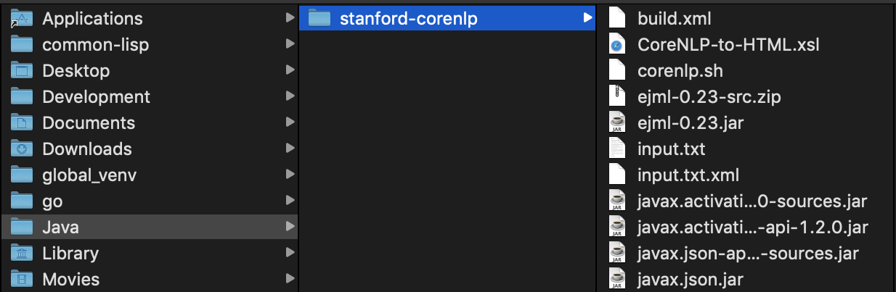

# Arxiv Edits

## Downloading Files

```bash
# activate virtualenv
python arxivedits/versions.py # or run versions.py however you like.

python arxivedits/source.py # or run source.py however you like.
```

## Installation

```bash
# clone and navigate to repo
git clone https://github.com/samuelstevens/arxiv-edits.git
cd arxiv-edits

# activate your python environment now
source ./venv/bin/activate

# install MASSAlign
cd ..
git clone https://github.com/samuelstevens/massalign.git
cd massalign
pip install -r requirements.txt
python setup.py install

# install oaipmh
cd ..
git clone https://github.com/infrae/pyoai.git
cd pyoai
pip install -r requirements.txt
pip install .

# install other dependencies
cd ../arxivedits # or however you get back to this project
pip install -r requirements.txt

# make sure you have pandoc installed
pandoc --version

# make sure you have sqlite3 installed
sqlite3 --version

# make the lcs.so library
make

# install arxivedits
pip install -e arxivedits/
```

### Java

To run the CoreNLP tokenizer, you need to edit the classpath in `tokenizer.py` to the location of your .jar

```python
self.classpath = '/Users/samstevens/Java/stanford-corenlp/*'
```

This path corresponds to this file structure:



You can now run the various scripts with:
```bash
python arxiv-edits/versions.py # etc
```

### Dependencies
* Python 3
* [MASSAlign for Python 3](https://github.com/samuelstevens/massalign)
* [Pandoc](https://pandoc.org/)
* [SQLite3](https://sqlite.org/index.html)
* [Stanford CoreNLP](https://stanfordnlp.github.io/CoreNLP/index.html#download)
* GCC and `make` (for the LCS algorithm)


## Gathering Data
Creates a sqlite3 database with all the papers on arxiv.org's version count
```bash
python arxiv-edits/versions.py 
```

Tries to download all documents with 2+ versions and then extracts the source files.

NOTE: you most likely want to run `download_all` (in `source.py`) for a bit, and then stop it. Otherwise, you will download 800K+ papers at 30 seconds / paper.
```bash
python arxiv-edits/source.py
```

Extracts the text from the `.tex` source files.
```bash
python arxiv-edits/tex.py
```

Adds all the words to the IDF lookup table.
```bash
python arxiv-edits/idf.py
```

Takes raw text and sections it by section title
```bash
python arxiv-edits/sections.py
```

Takes raw text and converts it to sentences
```bash
python arxiv-edits/tokenizer.py
```

Evaluates algorithms based on manually aligned data (in `arxivedits/data/alignments`).
```bash
python arxiv-edits/evaluate.py
```